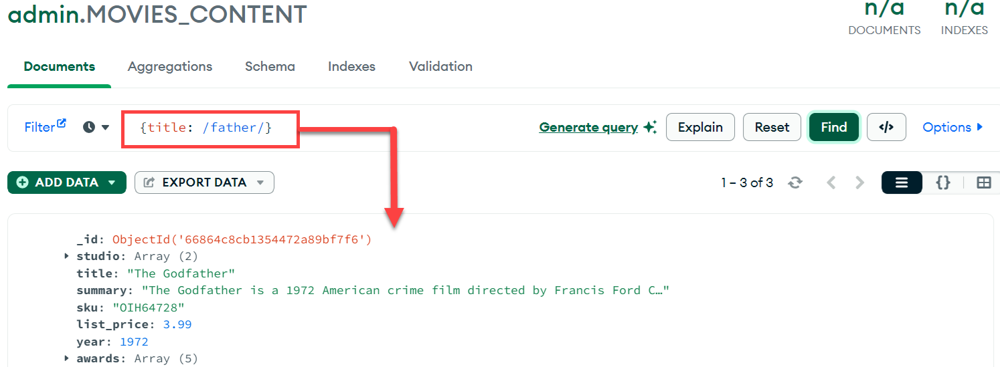

# Migrating MongoDB collections to Oracle Database 23ai

## Introduction

Database migrations from MongoDB to Oracle can be done using external tables if the collections have been already extracted as individual text files especially in the case when only the data needs to be transferred (indexes and other objects will be created afterwards). Or sometimes one wants to transfer JSON collections from different document databases to an Oracle database, this might be a simple way to do it.

The ORACLE_BIGDATA adapter for external tables can now (in Oracle Database 23ai) stream external JSON sources into the database making it easy and efficient query and load JSON stored in text files. In this lab, we will migrate a JSON collection called MOVIES into Oracle Database 23.5 and will test the end-result from both SQL Developer and MongoDB Compass.


Estimated Time: 10 minutes


### Objectives

In this lab, you will:

- Transfer the JSON collection to the Oracle database server
- Create the database directory object
- Create an external table
- Create a JSON COLLECTION TABLE
- Insert the data from the external table to the JSON collection table
- Validate the newly created collection table


### Prerequisites

- Oracle Database 23.5 with direct OS access as oracle user
- MongoDB Compass installed on your machine
- All previous labs successfully completed


## Task 1: Clean up the environment:

1. Follow these steps to clean up your environment:

    ```
    <copy>
    drop TABLE if exists json_file_content purge;
    drop TABLE if exists movies_content purge;
    </copy>
    ```

## Task 2: Create the JSON collection table

1. Follow this code to run:

    ```
    <copy>
    CREATE JSON COLLECTION TABLE movies_content;
    </copy>
    ```

## Task 3: Insert the data into the table granted

1. Follow this code to run:

    ```
    <copy>
    insert into movies_content
    select * from external (
        (data json)
        TYPE ORACLE_BIGDATA
        ACCESS PARAMETERS (
        com.oracle.bigdata.fileformat=jsondoc
        com.oracle.bigdata.json.unpackarrays=true
        )
        location ('https://c4u04.objectstorage.us-ashburn-1.oci.customer-oci.com/p/EcTjWk2IuZPZeNnD_fYMcgUhdNDIDA6rt9gaFj_WZMiL7VvxPBNMY60837hu5hga/n/c4u04/b/livelabsfiles/o/labfiles/movies.json')
    );
    commit;
    </copy>
    ```

## Task 4: Test the newly create JSON collection table in the Oracle database. List all movies having a name like %father%


1. In SQL Developer run:
    ```
    <copy>
    select m.data.title from movies_content m where m.data.title like '%father%';
    </copy>

    ```

2. In MongoDB Compass, for _MOVIES\_CONTENT_ filter on the name for father:

    ```
    <copy>
    {title: /father/}
    </copy>
    ```
    

## Learn More

* [Oracle Database Utilities ](https://docs.oracle.com/en/database/oracle/oracle-database/23/sutil/oracle-bigdata-access-driver.html#GUID-6D3221AD-9674-4BC0-B622-809A1F6569F9)

## Acknowledgements

* **Author** - Julian Dontcheff, Hermann Baer
* **Contributors** -  David Start, Ranjan Priyadarshi, Kevin Lazarz
* **Last Updated By/Date** - Carmen Berdant, Technical Program Manager, August 2024